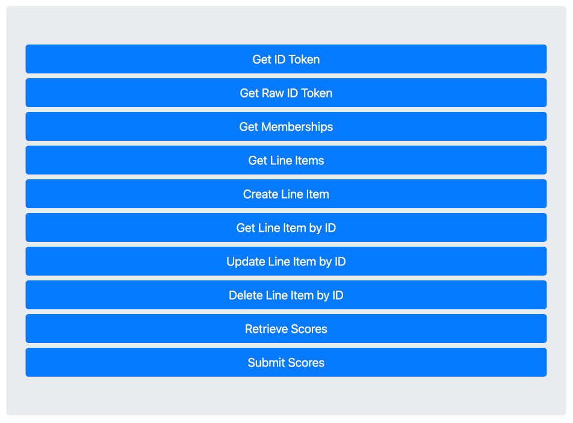

# Firebase LTI Test Tool

_Powered By_ 

This repo contains the code needed to create a simple [LTI 1.3](https://www.imsglobal.org/spec/lti/v1p3) test tool using the [LTIaaS](https://ltiaas.com) api.

## Setup

1. Create a free account with LTIAAS by following this guide: [https://ltiaas.com/docs/account_setup/](https://ltiaas.com/docs/account_setup/).

    > When you create the account, feel free to enable all LTI 1.3 services to get the full usage of this test tool.

2. Create a Firebase project and make sure to upgrade it to a _Blaze_ plan so that cloud functions can be used. Follow [this guide](https://codinglatte.com/posts/how-to/how-to-create-a-firebase-project/) if you need help.

    > Make sure you have NodeJS 16+ and the latest firebase CLI tools installed.

3. Edit `.firebaserc` and enter your Firebase project ID in place of `[YOUR_PROJECT_ID]`

4. During step 1, an LTIAAS URL and API Key will have been generated. Add the Ltiaas URL and API key to the Firebase project's environment.

```bash
# replace API_KEY with the key given to you by LTIaaS
firebase functions:config:set env.apikey="API_KEY"
# replace YOUR with the subdomain given to you by LTIaaS
firebase functions:config:set env.ltiaasurl="https://YOUR.ltiaas.com"
```

5. Install and deploy the project to Firebase

```bash
cd functions/
npm install
npm run deploy
```

This will generate two new Firebase functions and the Firebase output log will tell you the URLs assigned to the new functions. For example:

```log
i  functions: updating Node.js 16 function lti(us-central1)...
i  functions: updating Node.js 16 function api(us-central1)...
✔  functions[api(us-central1)] Successful update operation.
✔  functions[lti(us-central1)] Successful update operation.
Function URL (lti(us-central1)): https://[FIREBASE_PROJECT].cloudfunctions.net/lti
Function URL (api(us-central1)): https://[FIREBASE_PROJECT].cloudfunctions.net/api
i  functions: cleaning up build files...

✔  Deploy complete!
```

6. Take the two URLs from the firebase log and enter them into the [API Settings page](https://ltiaas.com/docs/account_setup/#step-4-set-your-api-settings) of your LTIaaS project.

    - *Launch URL*: `https://[FIREBASE_PROJECT].cloudfunctions.net/lti/launch`
    - *Deep Linking URL*: `https://[FIREBASE_PROJECT].cloudfunctions.net/lti/deeplink`

## Register With An LMS

An LTI 1.3 Tool is not very useful if there's no LMS to connect it with. LTIaaS has documentation on [how to register an LTIaaS tool with all of the popular LMSes](https://ltiaas.com/docs/lms_setup/portal_registration/).

If you don't have an LMS available, there are several [test LMS options](https://ltiaas.com/docs/lms_setup/prerequisites/#accessing-a-test-lms) that might work for you.

## Using The Tool

Once you register your test tool with an LMS, use the LMS to launch the tool. LTIaaS servers will handle the LTI OAuth process and redirect to the test tool landing page that looks like this:



Clicking the buttons will allow you to send LTI requests to the LMS using the LTIaaS API.